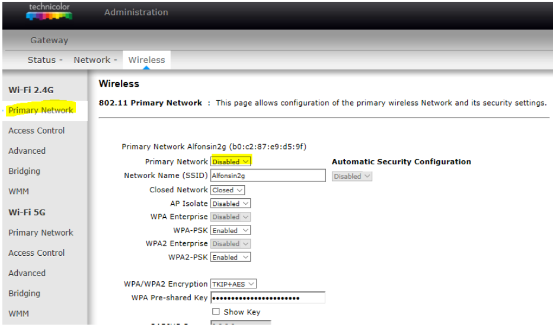
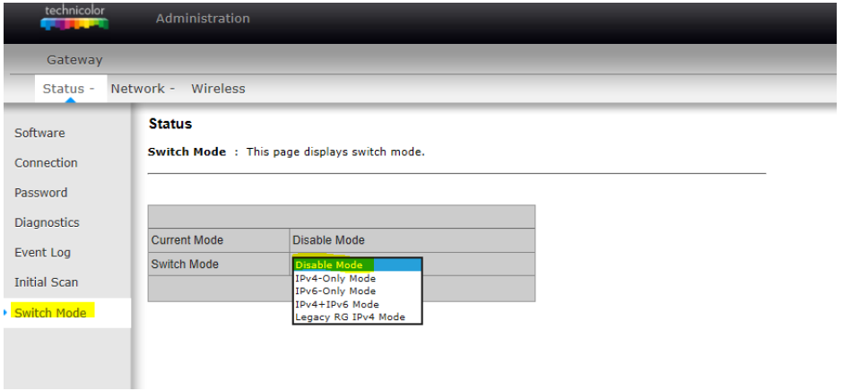

# Instalacion rapida 


## Configuracion teclado en Español

Para configurar el teclado en Español es necesario ejecutar los siguientes comandos:

Ejecuta el comando <i> sudo dpkg-reconfigure locales </i>. Aparecerá una lista de las codificaciones disponibles.
Busca español de España <b> (es_ES) </b>, preferiblemente con codificación <b> UTF-8 </b> y pulsa la barra espaciadora para seleccionarlo. Se recomienda no eliminar el inglés de Reino Unido, aunque es una opción personal. Pulsa intro para continuar.
Selecciona el idioma predeterminado de entre los que has marcado antes <b> (es_ES.UTF-8) </b> y pulsa intro. Se generarán los locales.

A continuación elegiremos la configuración del teclado.

Ejecuta <i> sudo dpkg-reconfigure keyboard-configuration </i>. Seleccionar <b> Generic 104-key PC </b>, pulsar intro para seleccionarlo. Una vez aparezca la siguiente ventana seleccionar <b> Other </b> y en la lista que se despliega seleccionar <b> Spanish </b>. Tras esto, seleccionar <b> The default for the keyboard layout </b> y por ultimo <b> No compose key </b>.

Ahora vamos a elegir la zona horaria:

Ejecuta <i> sudo dpkg-reconfigure tzdata </i>.
Selecciona <b> Europa </b> y después <b> Madrid </b> o la zona horaria en la que te encuentres.

Por ultimo solo queda reiniciar y ya estaria.
 

## Instalacion Home Assistant

Lo primero va a ser encender la pi, sacar la ip, conectar con el putty y luego descargar el archivo <b> setup.sh </b> con <i> wget </i> . Despues de eso se convierte en ejecutable con el
comando <i> chmod 755 setup.sh </i> y tras esto ejecutarlo de forma <i> sh setup.sh </i>. Cuando acabe la instalacion es necesario teclear de forma manual los siguientes comandos:

```bash
cd /srv/homeassistant
python3 -m venv .
source bin/activate
python3 -m pip install wheel
pip3 install homeassistant
hass
```
Tras acabar la instalacion poner en el navegados <b> IPRaspberry:8123 </b> e iniciar sesion en Home Assistant. Suele tardar en cargar en torno a 5 - 10 min. Una vez iniciada sesion, teclear <b> Ctrl + c </b> y despues: 
```bash
exit
cd
```
De esta forma salimos del entorno. Una vez salimos hacemos ejecutable el archivo <b> setup2.sh </b> y ejecutarlo. En medio de la instalacion saltara un cuadro de escritura, copiar y pegar lo siguiente:

[Unit] <br/> Description=Home Assistant <br/> After=network-online.target <br/> <br/> [Service] <br/> Type=simple <br/> User=root <br/> ExecStart=/srv/homeassistant/bin/hass -c "/home/homeassistant/.homeassistant" <br/> <br/> [Install] <br/> WantedBy=multi-user.target
 
Una vez modificado, como siempre lo guardamos con <b> Ctrl + o </b> y salimos con <b> Ctrl + x </b> . De esta forma ya tenemos <b> Home Assistant </b> funcionando y de forma que se inicie al arrancar la Raspberry.

## Instalacion Mosquitto

Para la instalacion de <b> Mosquitto </b> tan solo es necesario descargar con <i> wget </i> el archivo <b> mosquito.sh </b> , convertirlo a ejecutable con <i> chmod 755 </i> y ejecutarlo. Casi al final de la instalacion nos pedira la contraseña para nuestro server mosquitto, tras introducirla la instalacion finalizara y ya estara instalado <b> Mosquitto </b> . ( El usuario por defecto es <i> insega </i> ).

Tras introducir la contraseña se abrira un cuadro de texto en el que hay que hacer el siguiente cambio: <br/> <br/> After=network-online.target &nbsp;&nbsp; <b> ==> </b> &nbsp;&nbsp; After=network-online.target mosquitto.service

Una vez modificado, como siempre lo guardamos con <b> Ctrl + o </b> y salimos con <b> Ctrl + c </b>.

Por ultimo, para activar el <b> Mosquitto </b> en <b> Homeassistant </b> es necesario entrar en el archivo de configuracion:

```bash
sudo –u homeassistant –H –s
cd /home/homeassistant/.homeassistant 
nano configuration.yaml
```
Se abrira un archivo en el cual se debe escribir en cualquier linea:

```bash
mqtt:
  broker: IPRaspberry
  port: 1883
  username: insega
  password: YourPassword
```  
<b> Es importante respetar los espacios tal y como se muestra. </b> 


## Instalacion Zigbee2MQTT

Para la instalacion de <b> Zigbee2MQTT </b> tan solo es necesario descargar con <i> wget </i> el archivo <b> zigbee.sh </b> , convertirlo a ejecutable con <i> chmod 755 </i> y ejecutarlo. El proceso de instalacion comenzara hasta que a la mitad de la instalacion saltara un cuadro con el archivo de configuracion del <b> Zigbee2MQTT </b> . Este debe modificarse para que quede de la siguiente forma:

#&nbsp;Home Assistant integration (MQTT discovery) <br/> homeassistant: true <br/> #&nbsp;allow new devices to join <br/> permit_join: true <br/> #&nbsp;MQTT settings <br/> mqtt: <br/> &nbsp;&nbsp; #&nbsp;MQTT base topic for zigbee2mqtt MQTT messages <br/> &nbsp;&nbsp; base_topic: zigbee2mqtt <br/> &nbsp;&nbsp; #&nbsp;MQTT server URL <br/> &nbsp;&nbsp; server: 'mqtt://localhost' <br/> &nbsp;&nbsp; #&nbsp;MQTT server authentication, uncomment if required: <br/> &nbsp;&nbsp; user: insega <br/> &nbsp;&nbsp; password:&nbsp;<i> YourPassword </i> <br/> #&nbsp;Serial settings <br/> serial: <br/> &nbsp;&nbsp; #&nbsp;Location of CC2531 USB sniffer <br/> &nbsp;&nbsp; port: /dev/ttyACM0

Una vez modificado, como siempre lo guardamos con <b> Ctrl + o </b> y salimos con <b> Ctrl + c </b> . Automaticamente saltara otro cuadro de texto en el que es necesario copiar el siguente texto:

[Unit] <br/> Description=zigbee2mqtt <br/> After=network.target <br/> <br/> [Service] <br/> ExecStart=/usr/bin/npm start <br/> WorkingDirectory=/opt/zigbee2mqtt <br/> StandardOutput=inherit <br/> StandardError=inherit <br/> Restart=always <br/> User=pi <br/> <br/> [Install] <br/> WantedBy=multi-user.target

Una vez modificado, como siempre lo guardamos con <b> Ctrl + o </b> y salimos con <b> Ctrl + c </b> . Con esto acabara la instalacion de <b> Zigbee2MQTT </b> . Por ultimo para saber si la instalacion ha salido bien se puede usar el comando <i> sudo systemctl status zigbee2mqtt </i> , y si queremos ver la salida en tiempo real del <b> Mosquitto </b> junto con la del <b> Zigbee2MQTT </b> para agregar los dispositivos, usamos el comando ```mosquitto_sub -v -h IPRaspberry -p 1883 -t '#'```.

Para cambiar el nombre de los dispositivos <b> Zigbee2MQTT </b> es necesario introducir el siguente comando:

```bash
nano /opt/zigbee2mqtt/data/configuration.yaml
```
Y en el archivo cambiar el <b>friendly_name</b>.


## Instalacion MotionEye


Para la instalacion de <b> MotionEye </b> tan solo es necesario descargar con <i> wget </i> el archivo <b> eye.sh </b> , convertirlo a ejecutable con <i> chmod 755 </i> y ejecutarlo.

Una vez acabe la instalacion se puede acceder a <i> MotionEye </i> poniendo la IP <b> IPRaspberry:8765 </b>. Aparecera la pantalla inicial y para iniciar sesion ponemos en <i> Username: admin </i> y en <i> Password: </i> no ponemos nada.

Para añadir la camara directa de la Raspberry, seleccionamos la opcion <i> add camera... </i> y en <i> Camera Type: Local MMAL Camera </i>. Activamos las opciones avanzadas y modificamos los parametros necesarios. 

<b> Nota:</b> Para usar las notificaciones por <b> MQTT </b> es necesario tener instalado <b> mosquito.sh </b> y una vez instalado utilizamos la opcion <i> Run A Command </i> en la que debe escribirse el codigo: <i>  mosquitto_pub -h 192.168.31.xxx -u username -P password -t camaras/camara/movimiento -m "ON" </i>. 

## Instalacion OpenALPR en local

Instalar los prerrequisitos

```bash
sudo apt-get install cmake
sudo apt-get update
sudo apt-get install openalpr 
sudo apt-get install openalpr-daemon 
sudo apt-get install openalpr-utils 
sudo apt-get install libopenalpr-dev
sudo apt-get install libopencv-dev
sudo apt-get install libtesseract-dev
sudo apt-get install git
sudo apt-get install build-essential
sudo apt-get install libleptonica-dev
sudo apt-get install liblog4cplus-dev
sudo apt-get install libcurl3-dev
```

Si se utiliza daemon instalar beanstalkd

```bash
sudo apt-get install beanstalkd
```

Clonar el ultimo codigo de Git

```bash
git clone https://github.com/openalpr/openalpr.git
```

Establecer el directorio de compilacion

```bash
cd openalpr/src
mkdir build
cd build
```

Establecer el entorno de compilacion

```bash
cmake -DCMAKE_INSTALL_PREFIX:PATH=/usr -DCMAKE_INSTALL_SYSCONFDIR:PATH=/etc ..
cmake -DWITH_TEST=FALSE -DWITH_BINDING_JAVA=FALSE --DWITH_BINDING_PYTHON=FALSE \
  --DWITH_BINDING_GO=FALSE -DWITH_DAEMON=FALSE -DCMAKE_INSTALL_PREFIX:PATH=/usr ..
```

Compilar la libreria

```bash
make
```

Instalar los binarios en el sistema

```bash
sudo make install
```

Probar la libreria

```bash
wget http://plates.openalpr.com/h786poj.jpg -O lp.jpg
alpr lp.jpg
```

Una vez probada la libreria, instalamos OpenALPR en Home Assistnat
```bash
image_processing:
  - platform: openalpr_local
    region: eu
    source:
    - entity_id: camera.camara
      name: entrada
```
Para integrar la camara en Home Assistant con MotionEye lo mejor es utilizar mjpeg:
```bash
camera:
  - platform: mjpeg
    mjpeg_url: http://192.xxx.xxx.xxx:xxx/stream
    name: camara
```
En caso de que funcione ffmpeg se integra de forma:

```bash
ffmpeg:
  ffmpeg_bin: /usr/bin/ffmpeg
camera:
  - platform: ffmpeg
    input: rtsp://ipdetucamara:554/onvif1
    name: camara
```

Y para la automatizacion al detectar una matricula:
```bash
- id: '1561983915446'
  alias: matricula2
  trigger:
  - event_data:
      entity_id: image_processing.entrada
      plate: 2093GSW
    event_type: image_processing.found_plate
    platform: event
  - event_data:
      entity_id: image_processing.entrada
      plate: 3685HDP
    event_type: image_processing.found_plate
    platform: event
  condition: []
  action:
  - data:
      entity_id: switch.porton1
    service: switch.turn_on
```

## Instalacion de un Bot de Telegram

Lo primero que se necesita es una cuenta en <b> Telegram </b>. Una vez que se tiene la cuenta se debe crear el <b> Bot </b>, para ello se tiene que buscar en la lista de contactos el contacto <b> BotFather </b> que tendra este aspecto:


Para crear un nuevo bot, iniciamos conversacion con <i> /start </i> y acto seguido creamos el bot con <i> /newbot </i>. Para completar la creacion nos pedira el nombre del bot y demas, los introducimos y finalmente saldra un mensaje en el que aparecera el token de nuestro bot. Ahora que tenemos creado el bot es necesario conectarlo con <b> Home Assistant </b>, par ello necesitamos primero saber el ID de nuestro chat de telegram. Para ello tenemos que buscar el contacto <b> IDBot </b> que tendra este aspecto:


Al igual que antes solo tenemos que iniciar conversacion con <i> /start </i> y acto seguido utilizamos el comando <i> /getid </i> para obtener nuestra ID. Esta ID debemos guardarla. Si queremos que nos lleguen mensajes a un grupo con varias personas, lo que se necesita es, en primer lugar meter en el grupo de <b> Telegram </b> al bot y a las demas personas. Luego añadimos al <b> IDBot </b> y escribimos <i> /getgroupid </i>. El <b> IDBot </b> nos devolvera la ID del grupo que debemos guardar.

Ahora debemos ir al `configuration.yaml` para integrar el bot:

```bash
telegram_bot:
  - platform: polling
    api_key: YOUR_TOKEN
    allowed_chat_ids:
      - ID_1
      - ID_2
      
notify:
  - platform: telegram
    name: telegram1
    chat_id: ID_1

  - platform: telegram
    name: grupo1
    chat_id: ID_2
```
Y ahora editaremos el `automations.yaml` para poder enviar y recibir mensages asi como ejecutar ordenes y demas:

```bash
- id: '1557757478416'
  alias: telegrammsg
  trigger:
  - entity_id: SOME_SENSOR
    from: 'off'
    platform: state
    to: 'on'
  condition: []
  action:
  - data:
      data:
        inline_keyboard:
        - Pasar:/30m, Apagar:/1h
      message: Luz de la cocina encendida
    service: notify.telegram1
  - data:
      data:
        inline_keyboard:
        - Pasar:/30m, Apagar:/1h
      message: Luz de la cocina encendida
    service: notify.grupo1
```
En esta automatizacion lo que se hace es que cuando se activa un trigger se envia un mensage junto con dos botones, uno con el texto `Apagar` y otro `Pasar`. Este se envia tanto al grupo como al chat individual.

```bash    
- id: '1557757478426'
  alias: Telegramcallback
  trigger:
  - event_data:
      data: /1h
    event_type: telegram_callback
    platform: event
  action:
  - data:
      payload: apagada
      topic: cameras/time
    service: mqtt.publish
  - service: telegram_bot.edit_replymarkup
    data_template:
      message_id: '{{ trigger.event.data.message.message_id }}'
      chat_id: '{{ trigger.event.data.user_id }}'
      inline_keyboard: []
  - service: telegram_bot.answer_callback_query
    data_template:
      callback_query_id: '{{ trigger.event.data.id }}'
      message: Apagada Señor
```

En esta automatizacion lo que se hace es recibir la respuesta del boton `Apagar` y manda un comando por MQTT y ademas hace desaparecer los botones asi como manda un mensaje temporal de vuelta con la confirmacion de que se ha recibido la orden de apagar.

## Instalacion ESPHome

Tan solo es necesario introducir los siguientes comandos: <br/>

```bash
sudo apt-get update
sudo apt-get install python
python2 --version
```

Comprobar que la version de Python es igual o superior a la 2.7.X. Luego ejecutar: <br/>
```bash
wget https://bootstrap.pypa.io/get-pip.py
sudo python2 get-pip.py
sudo pip2 install esphome
sudo apt-get install git
sudo apt-get install python-dev python-setuptools 
sudo apt-get install libjpeg-dev
git clone https://github.com/python-pillow/Pillow.git
cd Pillow
python setup.py install
```

Y si no ha habido errores ejecutar `esphome config/ dashboard` (en caso de error de required, ir al archivo que pone y borrar lo de required) y abrir la <b> IPRaspberry:6052 </b>. Una vez dentro configurar el dispositivo como wemos D1 y por nombre el que queramos, y por ultimo editar el archivo y copiar el codigo del archivo <b> codeESP8266 </b>.

## Instalacion Beok

Lo primero sera descargar todos los archivos de la carpeta <b> beok </b> y pegar las 6 carpetas en el siguiente directorio de la Raspberry usando el WinSC: <b> /srv/homeassistant/lib/python3.5/site-packages </b>.

Una vez copiado sera necesario copiar el archivo climate.py dentro de la carpeta <b> custom_componets/beok </b>, para ello ejecutar el siguiente codigo (omitir los <b> mkdir </b> en caso de tener las carpetas creadas).

```bash
mkdir custom_components
cd custom_components
mkdir beok
cd beok
wget https://raw.githubusercontent.com/assur93/install/master/beok/climate.py
wget https://raw.githubusercontent.com/assur93/install/master/beok/__init__.py
``` 
Despues de esto solo quedaria ir a la carpeta <b> configuration.yaml </b> y copiar el siguiente codigo:

```bash
climate:
  - platform: floureon
    name: oficina
    mac: 78:0f:77:xx:xx:xx
    host: 192.168.xx.xxx
``` 
Para sacar la <b>MAC</b> y la <b>IP</b>, agregamos el termo al wifi, para ello, lo conectamos a corriente, presionamos la flecha abajo y despues el boton de encender, parpadearan las opciones. Con el boton <b>M</b> cambiamos hasta que aparezca la opcion <b>FAC</b>, en esa opcion presionamos la flecha arriba hasta que el numero pase de 8 a 10. Apagamos y luego salimos del modo de configuracion presionando la flecha abajo y despues el boton de encender. Una vez hecho esto el simbolo del wifi parpadea, en este momento vamos a la <b>app</b> de <b>Beok</b> y añadimos el termostato. Una vez añadido abrimos en el navegador la pagina del router y vemos en los dispositivos conectados la <b>IP</b> y la <b>MAC</b> del beok.

## Configuracion Router Multicolor

Lo primero es entrar en el router accediendo a la IP de configuracion, por lo general la IP suele ser ```192.168.0.1```
Y meter el usuario y la contraseña que suelen venir debajo del router, en caso negativo, llamar a la compañia.

Una vez en el router desactivar el wifi, tanto el 2,4G como el 5G.



Una vez desactivado, cambiar el modo del router de  ```Legacy RG IPv4 Mode``` a ```Disable Mode```



<b>Para volver al estado inicial solo tenemos que volver a cambiar el modo del router y volver a  activar el wifi</b>


## Configuracion Router Xiaomi


Lo primero es entrar en el router accediendo a la IP de configuracion ```192.168.31.1``` y meter la contraseña ```insega1993```.

Una vez en el router traducimos la pagina y vamos a <b> Ajustes avanzados > Reenvio de puertos </b> <i>(o algo similar)</i>. Una vez en este punto solo tenemos que presionar en <b>Agregar regla</b> y redireccionar los puertos <b> 8123 , 80 , 443 </b> usando la siguiente estructura:
```bash
Indicar Nombre
Seleccionar: TCP y UDP
Puerto Externo: 8123
Dirección IP Interna: 25
Puerto Interno: 8123
```

Y asi con los otros 2 puertos. Una vez acabado ya estaria.


## Instalacion DuckDns y certificado HTTPS

Lo primero sera entrar en https://www.duckdns.org e ingresar utilizando la cuenta de Gmail. Una vez iniciada sesion, añadimos un dominio con ```add domain```. Una vez añadido el domain pinchamos en ```install``` y seleccionamos ```pi```, nos apareceran en la parte de abajo las instrucciones a seguir. Lo unico, es sustituir la linea ```vi duck.sh``` por ```nano duck.sh``` ya que este editor es mejor.

Una vez instalado todo pasamos a instalar el certificado <b>HTTPS</b>, para ello ejecutaremos las siguientes instrucciones en orden:

```bash
sudo apt-get install git
sudo su -s/bin/bash homeassistant
cd ..
cd homeassistant
git clone https://github.com/lukas2511/dehydrated.git
cd dehydrated
nano domains.txt
```
Y en el archivo que se genera pegamos el dominio que creamos antes ```dominio.duckdns.org``` y como siempre lo guardamos con <b> Ctrl + o </b> y salimos con <b> Ctrl + c </b>. Ahora creamos otro archivo con la instruccion ```nano config``` y en el pegamos el siguiente texto:

```bash
# Which challenge should be used? Currently http-01 and dns-01 are supported 
CHALLENGETYPE="dns-01" 
# Script to execute the DNS challenge and run after cert generation 
HOOK="${BASEDIR}/hook.sh"
```
Y como siempre lo guardamos con <b> Ctrl + o </b> y salimos con <b> Ctrl + c </b>.
Es necesario crear otro archivo con ```nano hook.sh``` y en el pegamos el siguiente texto:

```bash 
#!/usr/bin/env bash
set -e
set -u
set -o pipefail

domain="sgil19"
token="e8dbd8cf-707a-4a22-8d29-9953a503f00d"

case "$1" in
    "deploy_challenge")
        curl "https://www.duckdns.org/update?domains=$domain&token=$token&txt=$4"
        echo
        ;;
    "clean_challenge")
        curl "https://www.duckdns.org/update?domains=$domain&token=$token&txt=removed&clear=true"
        echo
        ;;
    "deploy_cert")
        sudo systemctl restart homeassistant.service
        ;;
    "unchanged_cert")
        ;;
    "startup_hook")
        ;;
    "exit_hook")
        ;;
    *)
        echo Unknown hook "${1}"
        exit 0
        ;;
esac
```
Y como siempre lo guardamos con <b> Ctrl + o </b>, salimos con <b> Ctrl + c </b> y lo convertimos en ejecutable con la instruccion ```chmod 755 hook.sh```.
Ahora ejecutamos la instruccion ```./dehydrated --register --accept-terms``` y esperamos hasta que aparezca <b>Done!</b> en pantalla.

Ahora ejecutamos la instruccion ```./dehydrated -c``` y esperamos hasta que nos pida la contraseña de admin de HA, en este punto salimos pulsando <b> Ctrl + c </b> .

Ahora ejecutamos la instruccion ```crontab -e``` y en el editor que sale al final de todo pegamos la siguiente linea 

```0 1 1 * * /home/homeassistant/dehydrated/dehydrated -c```

y como siempre lo guardamos con <b> Ctrl + o </b>, salimos con <b> Ctrl + c </b>.

Por ultimo solo tenemos que ir a alchivo de configuracion de HA ```configuration.yaml``` y añadir el siguente texto:

```bash 
http:
  ssl_certificate: /home/homeassistant/dehydrated/certs/xxxxxxxxx.duckdns.org/fullchain.pem
  ssl_key: /home/homeassistant/dehydrated/certs/xxxxxxxxx.duckdns.org/privkey.pem
  base_url: https://xxxxxxx.duckdns.org:8123
```
reiniciamos HA, para ello primero salimos con ```exit``` y reiniciamos con ```sudo systemctl restart homeassistant```.

Si todo ha salido bien la pagina deberia ser accesible desde https://<b>xxxxxxx</b>.duckdns.org:8123


## Instalacion Acceso con Matricula

Lo primero que se debe hacer es instalar la libreria  ```mqtt.paho``` mediante el comando:

```sudo pip install pahp-mqtt```

Despues de esto se debe abrir el ```configuration.yaml``` y añadir las siguientes lineas:

```bash 
homeassistant:    
  whitelist_external_dirs:
    - /tmp
    
shell_command:
  foto: python /home/pi/coche.py
  
camera:
  - platform: mjpeg
    name: entrada
    mjpeg_url: http://192.168.31.10:8081
    
```

Despues de esto se debe abrir el ```automations.yaml``` y añadir las siguientes lineas:

```bash 
- id: '1575022412320'
  alias: coche
  description: ''
  trigger:
  - payload: 'ON'
    platform: mqtt
    topic: camaras/camara/movimiento
  condition: []
  action:
  - data:
      entity_id: camera.entrada
      filename: /tmp/your.jpg
    service: camera.snapshot
  - delay: 00:00:01
  - service: shell_command.foto
  
- id: '1575026803891'
  alias: aporton
  description: ''
  trigger:
  - payload: 8996JNV
    platform: mqtt
    topic: matricula
  condition: []
  action:
  - data:
      entity_id: switch.luz1
    service: switch.turn_on    
 ```
 
 Despues de esto copiar el archivo ```coche.py``` en el directorio ```/home/pi```. Despues editarlo y cambiar la linea: 
  ```publish.single('matricula', (s), hostname='192.168.XX.XXX') ``` en la que se debe poner la IP de la Raspberry y la linea ```SECRET_KEY = 'sk_779f3b5259c0893e57cexxxxx'``` en la que se debe poner la clave de ALPR.
  
  Para añadir matriculas solo se deben añadir ```triggers```en la automatizacion.


